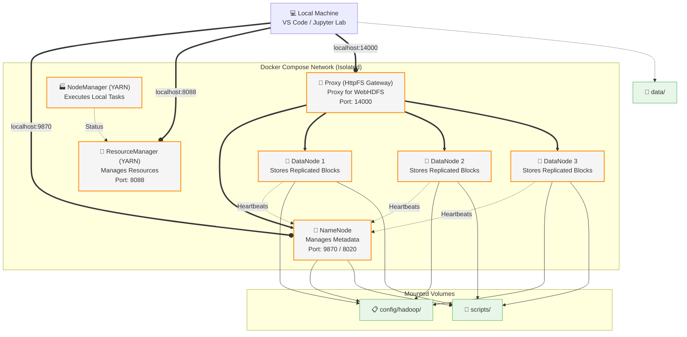

# 🐘 Big Data Lab: Apache Hadoop

### **The Practical Guide to Distributed Storage and Processing**
Explore the Hadoop ecosystem running on your local machine with a simulated Docker cluster, theory-backed content, and interactive notebooks.


---

## 🎯 What is this repository?

A **hands-on lab** to explore the foundational technology of the Big Data era. Learn how Hadoop solves the Volume problem by fragmenting data and bringing computation closer to storage.

- 📖 **Rich Documentation** — Theory based on academic fundamentals (MapReduce, HDFS, YARN).
- ⚙️ **Integrated Test Environment** — Spin up a cluster with NameNode, DataNodes, and ResourceManager with 1 command.
- 💻 **Interactive Guides (Labs)** — Actually interact with HDFS using Python and Pandas in Notebooks.

> **Target audience:** Students, data engineers, and scientists who want to master distributed persistence and understand the inner workings of Big Data systems.

---

## ⚡ Quick Start (5 minutes)

If you already have Docker and `make` installed, you can start the lab in three simple steps:

```bash
# 1. Clone the repository
git clone https://github.com/hiltonmbr/cdn-hadoop-lab.git
cd cdn-hadoop-lab

# 2. Start the Hadoop Cluster (runs in background)
make up

# 3. Set up the Python virtual environment and install dependencies
make setup-env
```

Now choose your path:

**🅰️ VS Code + Jupyter Extension (recommended)**
```bash
code .                          # Open the project in VS Code
# Install the "Jupyter" extension (ms-toolsai.jupyter) when VS Code prompts you
# Open a .ipynb file in notebooks/ and select the .venv kernel
```

**🅱️ Jupyter Lab via terminal**
```bash
make jupyter-lab                # Opens Jupyter Lab in the browser
```

Access the HDFS dashboard:
👉 **[View NameNode Dashboard](http://localhost:9870)**

---

## ⚙️ Prerequisites

To run the labs, ensure your machine meets the following requirements:

| Requirement | Details |
|---|---|
| **Docker Engine** | Essential for instantiating the cluster in an isolated manner |
| **Docker Compose** | Already bundled in Docker Desktop |
| **Make (optional)** | Used for terminal shortcuts |
| **Resources** | At least **4GB RAM** or more recommended |
| **Disk** | A few GB free for labs 4–6 (datasets are downloaded to `temp/` and stored in HDFS with ×3 replication) |

---

## 🗺️ Learning Map

To get the most out of the lab, we suggest the following theoretical and practical journey.

### 📖 Theory: Big Data Fundamentals
Read the theoretical documentation in the `docs/` folder before moving on to the hands-on practice.

| # | Theoretical Module | What you will learn | Link |
|:---:|:---|:---|:---:|
| 1 | **The problem and the history** | The limits of relational processing and the origin of Hadoop (GFS/MapReduce). | [📖 Read](docs/01-problem-and-history.md) |
| 2 | **HDFS Architecture** | NameNode, DataNode, block size, replication, and Rack Awareness. | [📖 Read](docs/02-hdfs-architecture.md) |
| 3 | **The Execution Paradigm** | Data Locality, MapReduce phases, and the role of YARN. | [📖 Read](docs/03-execution-paradigm.md) |
| 4 | **Hadoop Ecosystem** | Complementary tools: Spark, Hive, HBase, Kafka. | [📖 Read](docs/04-hadoop-ecosystem.md) |
| 5 | **Data Lakes and Cloud** | Medallion Architecture and transition to modern cloud. | [📖 Read](docs/05-data-lakes-and-cloud.md) |
| 6 | **Servers and Automation** | Bare-Metal deployment and IaC orchestration with Ansible. | [📖 Read](docs/06-server-deployment-ansible.md) |
| 7 | **HDFS Cheatsheet** | Reference guide with the main terminal commands. | [📖 Read](docs/07-essential-hdfs-commands.md) |

### 🧪 Hands-on Labs: Getting Your Hands Dirty
Our labs are inside the `notebooks/` folder. Open them in VS Code (with the Jupyter extension) or via `make jupyter-lab`.

| # | Topic | Description | Interactive Lab |
|:---:|:---|:---|:---:|
| 1 | 📂 **Manipulating HDFS via Python** | Distributed file reading and writing using the `hdfs` library. | [🧪 Go to Lab](notebooks/01_handle_hdfs.ipynb) |
| 2 | 🐼 **Pandas with Distributed Files** | Integration and data analysis directly from the Data Lake using Pandas. | [🧪 Go to Lab](notebooks/02_handle_hdfs_pandas.ipynb) |
| 3 | 🧰 **Essential HDFS Commands** | Every core HDFS operation as a CLI command + its Python equivalent. | [🧪 Go to Lab](notebooks/03_essential_hdfs_commands.ipynb) |
| 4 | 🧱 **Large Volume & Block Distribution** | Ingest multi-GB NYC Taxi data; *see* blocks, replication, and fault tolerance. | [🧪 Go to Lab](notebooks/04_large_volume_and_block_distribution.ipynb) |
| 5 | ⚙️ **MapReduce WordCount** | Run the canonical MapReduce job on YARN over a large text corpus. | [🧪 Go to Lab](notebooks/05_mapreduce_wordcount.ipynb) |
| 6 | 🌡️ **Hadoop Streaming (custom code)** | Distributed MapReduce with your own mapper/reducer on real NOAA weather data. | [🧪 Go to Lab](notebooks/06_hadoop_streaming_weather.ipynb) |

> 💡 **Labs 4–6 download larger datasets (~1–3 GB)** and demonstrate the cluster's distributed *processing* (YARN/MapReduce), not just storage. Each notebook starts small (1–2 files) so you can validate the flow before scaling up. Downloads land in the git-ignored `temp/` folder — clean it with `make clean` when done.

---

## 🏗️ Lab Architecture

The cluster simulates a real Hadoop environment using Docker Compose with an isolated network and mapped volumes.

```
📁 projeto/
├── config/hadoop/     → /opt/hadoop/etc/hadoop  (config XMLs generated by .env)
├── scripts/           → /scripts                (start-hdfs.sh, init-datanode.sh)
├── notebooks/         → Interactive Jupyter labs
├── docs/              → Theoretical fundamentals
└── temp/              → Temporary downloads & datasets (git-ignored)

# Datasets themselves live inside HDFS under /datasets/… (see labs 4–6),
# while their raw downloads are staged locally in temp/.
```



---

## 📝 Lab Administration Cheatsheet

In addition to the notebooks, you can test commands via terminal:

```bash
# ── Lab Orchestration ──
make up              # 🔥 Starts the Hadoop cluster (NameNode, DataNodes, YARN)
make down            # 😴 Puts the elephants to sleep
make clean           # 💥☢️ NUKES everything! Containers + HDFS data to the moon
make status          # 🔍 What's up with the containers?

# ── Accessing Terminals ──
make shell-namenode      # 🐚 NameNode CLI
make shell-datanode1     # 🐚 DataNode 1 CLI
make shell-datanode3     # 🐚 DataNode 3 CLI

# ── Running Notebooks Locally ──
make setup-env           # 🐍 Sets up the local Python environment with uv
make jupyter-lab         # 📓🚀 Starts Jupyter Lab in the browser
```

---

## 📄 License and References

This project is made available under the [MIT License](LICENSE).

> **Open educational material.** Created for the hands-on classes of the **Data Science for Business** course (UFPB). Developed by Hilton Martins.
